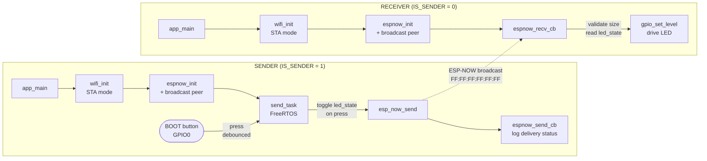

# ESP-NOW Wireless LED Control

> Press a button on one ESP32 and toggle an LED on another — directly over ESP-NOW, with no Wi-Fi router, no pairing, and no cloud.


---

## Overview

**What it solves:** wireless device-to-device control without any network infrastructure. Most "IoT" demos need a Wi-Fi router, an MQTT broker, or a cloud account just to turn an LED on. This project shows the leaner path: a physical button press on one ESP32 sends a command straight to another using **ESP-NOW**, Espressif's connectionless protocol built on the Wi-Fi radio.

**Who it's for:** embedded developers and makers who need low-latency, low-overhead links between microcontrollers — the foundation for remote sensors, wireless actuators, or controller/peripheral pairs where standing up a full TCP/IP stack is overkill.

**How it's structured:** a single firmware image runs on both boards. One compile-time flag (`IS_SENDER`) decides whether a board *broadcasts* commands or *listens* for them, so the entire system is one source file deployed twice with one line changed.

---

## Features / Highlights

- **Zero-infrastructure wireless link** — boards communicate directly via ESP-NOW broadcast; no access point, no IP addressing, no pairing handshake.
- **One firmware, two roles** — a single `IS_SENDER` flag flips a board between transmitter and receiver, keeping the codebase unified and easy to maintain.
- **On-demand actuation from a physical button** — pressing the on-board BOOT button toggles the command and sends it; the receiver drives its LED on arrival, with a typed payload so malformed packets are rejected by size check.
- **Debounced, one-press-one-command input** — falling-edge detection plus a 30 ms debounce and release-wait guarantee that a single press transmits exactly one command, with no bounce-induced duplicates.
- **Built-in delivery feedback** — a send callback logs `Delivery Success` / `Delivery Fail` for every packet, giving immediate link-quality visibility over the serial monitor.
- **Self-verifiable** — the sender mirrors the transmitted state on its own LED, so the transmit path can be confirmed even with a single board on the bench.
- **FreeRTOS task-based** — transmission runs in its own task, leaving the main thread free for future expansion (sensors, multiple peers, etc.).

---

## Architecture / Flow



**Why it's shaped this way:** ESP-NOW rides on the Wi-Fi PHY but skips the TCP/IP stack entirely. Bringing Wi-Fi up in station mode (`WIFI_MODE_STA`) without connecting to any AP is all the radio layer ESP-NOW needs, which is why the link forms instantly on power-up and survives with no router in the room.

---

## Command Protocol

The payload is a single typed struct broadcast on every transmission. The receiver only acts when the received length matches `sizeof(espnow_command_t)`, so unrelated broadcasts are ignored.

| Field       | Type   | Size   | Meaning                          |
|-------------|--------|--------|----------------------------------|
| `led_state` | `bool` | 1 byte | `true` = LED ON, `false` = LED OFF |

| Transport          | Value                                    |
|--------------------|------------------------------------------|
| Protocol           | ESP-NOW (connectionless, over Wi-Fi PHY) |
| Destination MAC    | `FF:FF:FF:FF:FF:FF` (broadcast)          |
| Encryption         | Disabled (`encrypt = false`)             |
| Channel            | `0` → use current Wi-Fi channel          |
| Trigger            | On-board button press (falling edge)     |
| Debounce           | 30 ms + wait-for-release                  |

---

## Pinout

| Signal       | GPIO | Direction | Notes                                                          |
|--------------|------|-----------|----------------------------------------------------------------|
| On-board LED | `2`  | Output    | Default integrated LED on most ESP32 dev boards (`BLINK_GPIO`)  |
| BOOT button  | `0`  | Input (pull-up) | On-board BOOT button, active LOW; triggers the send (sender only, `BUTTON_GPIO`) |

---

## Software Stack (by layer)

| Layer            | Component                                  | Role                                        |
|------------------|--------------------------------------------|---------------------------------------------|
| Application      | `espnow_test.c`                            | Role selection, send task, RX/TX callbacks  |
| Wireless         | ESP-NOW (`esp_now.h`)                       | Connectionless device-to-device messaging   |
| Radio            | Wi-Fi STA (`esp_wifi.h`)                    | PHY layer ESP-NOW rides on (no AP)           |
| OS               | FreeRTOS                                    | Task scheduling for the transmit loop        |
| Persistence      | NVS (`nvs_flash.h`)                         | Required storage init for the Wi-Fi stack    |
| HAL              | GPIO driver (`driver/gpio.h`)              | LED output control                           |
| Framework / Build| ESP-IDF + CMake                            | Toolchain, configuration, flashing           |

---

## Repository Structure

```
ESPNOW/
├── CMakeLists.txt          # Top-level ESP-IDF project definition
├── sdkconfig               # Generated IDF configuration (target: esp32)
├── main/
│   ├── CMakeLists.txt      # Registers espnow_test.c as a component
│   └── espnow_test.c       # All application logic (sender + receiver)
└── build/                  # Generated build artifacts (regenerated by idf.py)
```

---

## Build & Flash

Standard ESP-IDF workflow. Target chip is **ESP32** (already set in `sdkconfig`).

```bash
# 1. Export the ESP-IDF environment
. $IDF_PATH/export.sh

# 2. Configure roles: edit main/espnow_test.c
#    #define IS_SENDER 0   -> Receiver
#    #define IS_SENDER 1   -> Sender

# 3. Build, flash, and monitor each board on its own port
idf.py build
idf.py -p /dev/ttyUSB0 flash monitor
```

> **You need two boards.** Flash one with `IS_SENDER 1` (sender) and the other with `IS_SENDER 0` (receiver). Because the role is a compile-time flag, rebuild and reflash after changing it.

**Expected output**

```
# Sender  (each line below appears once per button press)
ESPNOW_TEST: Starting as SENDER. Press the button to toggle/send the LED command...
ESPNOW_TEST: Button pressed. Sending command: Turn LED ON
ESPNOW_TEST: Last Packet Send Status: Delivery Success

# Receiver
ESPNOW_TEST: Starting as RECEIVER. Waiting for LED commands...
ESPNOW_TEST: Received command: Turn LED ON
```

When working, each press of the sender's BOOT button toggles the receiver's LED in sync.

> **Toolchain note:** developed and tested on **ESP-IDF v6.0**. The callback signatures used (`esp_now_send_info_t`, `esp_now_recv_info_t`) require ESP-IDF v5.4 or newer.

---

## Author

**Juan Pablo Arenas** — Mechatronics Engineer, Pontificia Universidad Javeriana (PUJ)
GitHub: [@Fellbowl](https://github.com/Fellbowl)
